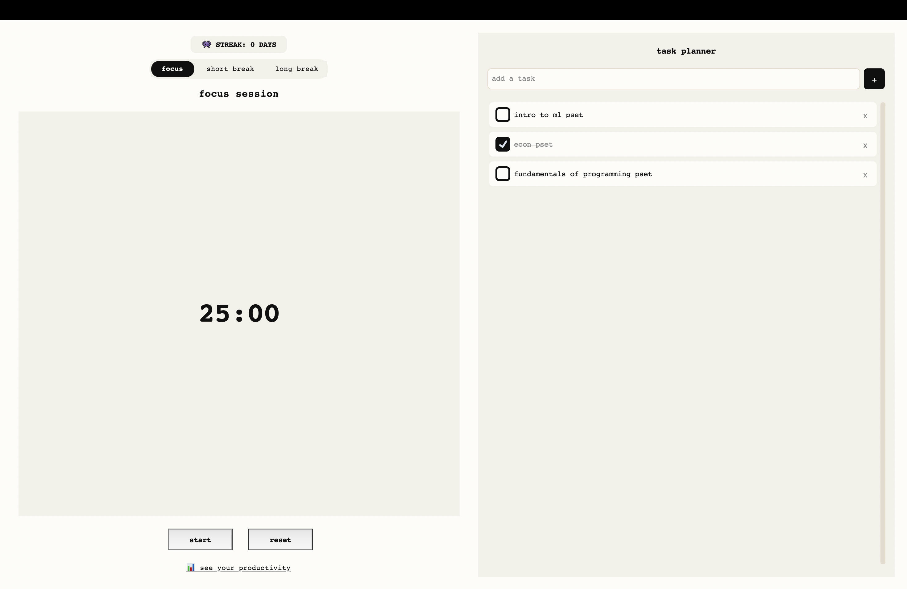

# Pomodoro Timer

A desktop productivity application that combines a Pomodoro timer, task planner, focus streaks, and productivity analytics.

## Features

- 25-minute focus sessions
- Short and long breaks
- Start, pause, and reset controls
- Persistent task planner
- Task completion tracking
- Daily focus streaks
- Weekly productivity analytics
- Local data storage with SQLite

## Built With

- Python
- CustomTkinter
- Tkinter
- SQLite
- Matplotlib

## Screenshot

## Screenshot



## Running Locally

Clone the repository:

```bash
git clone https://github.com/rojinaadhikarii/pomodorotimer.git
cd pomodorotimer
```

Create and activate a virtual environment:

```bash
python3 -m venv .venv
source .venv/bin/activate
```

Install the dependencies:

```bash
pip install -r requirements.txt
```

Run the application:

```bash
python app.py
```

## About

I built this project as a productivity tool for managing focused work sessions and daily tasks while visualizing focus habits over time.